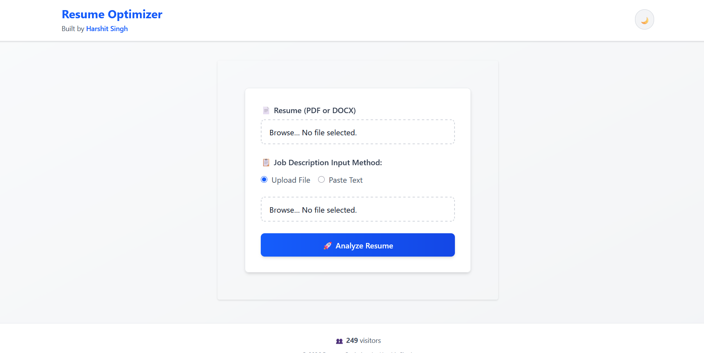

<div align="center">


<p align="center">
  
</p>

<p align="center">
  
</p>

[Report Bug](https://github.com/harshitsingh205/Ai-resume-optimizer/issues) · [Request Feature](https://github.com/harshitsingh205/Ai-resume-optimizer/issues)

</div>

---


## 📌 Overview
**Resume Optimizer** is an intelligent tool designed to bridge the gap between job seekers and Applicant Tracking Systems (ATS). By leveraging the **Google Gemini API**, it provides deep insights into how well your resume matches a specific job description.

### 🚀 Key Features
- **Smart Parsing:** Support for both `.pdf` and `.docx` formats.
- **Dual Input:** Upload JD files or paste text directly for instant analysis.
- **AI Insights:** Detailed match scores, missing keyword detection, and actionable improvement tips.
- **Modern UI:** Built with a sleek, responsive Tailwind CSS interface featuring Dark Mode.

---

## 🛠 Tech Stack

| Component | Technology |
| :--- | :--- |
| **Frontend** | Angular 20 (Signals, Standalone Components) |
| **Backend** | Node.js, Express |
| **AI Engine** | Google Gemini Pro |
| **Styling** | Tailwind CSS + ngx-markdown |
| **File Handling** | Multer, PDF-Parse, Mammoth |

---
## Frontend setup

# Install Angular dependencies
npm install

# Launch the development server
ng serve --open

## ⚙️ Getting Started

### Prerequisites
* Node.js (v20+)
* Angular CLI (`npm install -g @angular/cli`)
* [Gemini API Key](https://aistudio.google.com/app/apikey)

  

### 1. Backend Setup
```bash
cd backend
npm install


